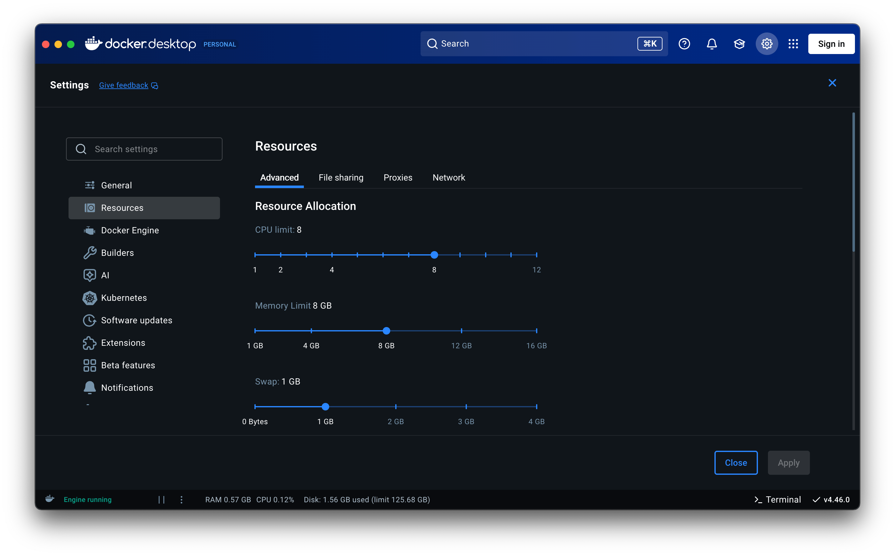

# Docker Setup

## Installation

Because the local setup was performed on macOS, this requires Docker Desktop.

The Docker Engine can't ruln directly as on Linux due to the fact that a separate and dedicated VM is required to initialize a Linux kernel.

Docker daemon (dockerd) runs containers, which are just Linux processes with cgroups + namespaces. This is fine on a Linux system, but even something Unix-based isn't sufficient.

Thus, Docker Desktop is required.

```bash
brew install --cask docker
```

## Configuration

Were this being done on Linux, the CLI could be used for configurations--not the case on macOS, as mentioned.

Below are the settings used for building images and running containers:



Additionally, storage allowance is set to **128 GB**.

## Basic Run

Simple Dockerfile used for build process:

```Dockerfile
# https://hub.docker.com/_/alpine
FROM alpine:3.22

# install python
RUN apk add --no-cache python3 py3-pip

# set environment variable
ENV SOMENAME=Peasant

# change working directory for storing files
WORKDIR /app

# copy .py file
COPY /src/docker_test.py ./

# execute script
CMD ["python", "./docker_test.py"]
```

## Intermediate Run

In contrast to the above, the instructions outlined in Dockerfile below are more nuanced. This installs and executes via the **uv** Python environment and package/dependency manager, and executes scripts with the `uv run` command.

```Dockerfile
# ----- base -----
# https://docs.astral.sh/uv/guides/integration/docker/
FROM python:3.12-slim AS base

# add uv
COPY --from=ghcr.io/astral-sh/uv:0.8.17 /uv /uvx /usr/local/bin/

# ----- deps -----
FROM base AS deps

# change working directory
WORKDIR /app

# copy requirements files
COPY pyproject.toml uv.lock ./

# install dependencies
RUN --mount=type=cache,target=/root/.cache/uv \
    --mount=type=bind,source=uv.lock,target=uv.lock \
    --mount=type=bind,source=pyproject.toml,target=pyproject.toml \
    uv sync --locked --no-install-project

# ----- runtime -----
FROM base AS runtime

# set environment variables
ENV PATH="/app/.venv/bin:$PATH" \
    UV_LINK_MODE=copy \
    PYTHONDONTWRITEBYTECODE=1 \
    PYTHONUNBUFFERED=1 \
    SOMENAME=Peasant

# change working directory
WORKDIR /app

# copy .py + reqs files
COPY src/docker_test.py ./

# execute
CMD ["uv", "run", "./docker_test.py"]
```

From project directory, run `docker build -f infra/local/Dockerfile . -t python-slim:latest`. This outputs the following:

```
[+] Building 4.6s (11/11) FINISHED                                                                              docker:desktop-linux
 => [internal] load build definition from Dockerfile                                                                            0.0s
 => => transferring dockerfile: 943B                                                                                            0.0s
 => [internal] load metadata for ghcr.io/astral-sh/uv:0.8.17                                                                    0.7s
 => [internal] load metadata for docker.io/library/python:3.12-slim                                                             0.4s
 => [internal] load .dockerignore                                                                                               0.0s
 => => transferring context: 2B                                                                                                 0.0s
 => FROM ghcr.io/astral-sh/uv:0.8.17@sha256:e4644cb5bd56fdc2c5ea3ee0525d9d21eed1603bccd6a21f887a938be7e85be1                    2.9s
 => => resolve ghcr.io/astral-sh/uv:0.8.17@sha256:e4644cb5bd56fdc2c5ea3ee0525d9d21eed1603bccd6a21f887a938be7e85be1              0.0s
 => => sha256:e4644cb5bd56fdc2c5ea3ee0525d9d21eed1603bccd6a21f887a938be7e85be1 2.19kB / 2.19kB                                  0.0s
 => => sha256:051cab757d3d1c7df81d33b386ac61e94fbcf6709a57732c64859b791529f76b 669B / 669B                                      0.0s
 => => sha256:7b919a06ff5176f1345ba4fd4ac752f20c0ea4872d5e5c6fdfbd2e0a9204d045 1.30kB / 1.30kB                                  0.0s
 => => sha256:500e56a2db9191ee69ca3b01def327300d7e8063a12cf9c2758c104fc4f502d6 20.10MB / 20.10MB                                2.7s
 => => sha256:06564fc8257c1ff35786df637f7287120df9b09f2fd2e212606b7f117f72f94e 98B / 98B                                        1.4s
 => => extracting sha256:500e56a2db9191ee69ca3b01def327300d7e8063a12cf9c2758c104fc4f502d6                                       0.2s
 => => extracting sha256:06564fc8257c1ff35786df637f7287120df9b09f2fd2e212606b7f117f72f94e                                       0.0s
 => [internal] load build context                                                                                               0.0s
 => => transferring context: 236B                                                                                               0.0s
 => [base 1/2] FROM docker.io/library/python:3.12-slim@sha256:abc799c7ee22b0d66f46c367643088a35e048bbabd81212d73c2323aed38c64f  3.6s
 => => resolve docker.io/library/python:3.12-slim@sha256:abc799c7ee22b0d66f46c367643088a35e048bbabd81212d73c2323aed38c64f       0.0s
 => => sha256:0467c51f4df7a7f4437d09713b2a6e17bdef2c2f97fb76a2292759ab8e4a33ed 1.75kB / 1.75kB                                  0.0s
 => => sha256:12201b64d1f192c962c7b74947706000df3ef3f994cf6f4e3206060938a0faa0 5.59kB / 5.59kB                                  0.0s
 => => sha256:b2feff975e6dd2ebaf182772fb9ee26274648387b061e821e0bb5026735dd094 30.14MB / 30.14MB                                2.4s
 => => sha256:b820d61756c82267754c3cab22f999f9fc35d8f523d2be997fe0c9bc8b1e7981 1.27MB / 1.27MB                                  0.6s
 => => sha256:4465c5ecfdf68a025d0d4acd8a0cb1c37df327de1175133fb2d6eb0fd03c921d 12.04MB / 12.04MB                                1.1s
 => => sha256:abc799c7ee22b0d66f46c367643088a35e048bbabd81212d73c2323aed38c64f 10.37kB / 10.37kB                                0.0s
 => => sha256:24c38a7def800b4bbf4cd068e4d0d001d62777b88ff70db184fbb6cf1c296789 249B / 249B                                      0.9s
 => => extracting sha256:b2feff975e6dd2ebaf182772fb9ee26274648387b061e821e0bb5026735dd094                                       0.7s
 => => extracting sha256:b820d61756c82267754c3cab22f999f9fc35d8f523d2be997fe0c9bc8b1e7981                                       0.1s
 => => extracting sha256:4465c5ecfdf68a025d0d4acd8a0cb1c37df327de1175133fb2d6eb0fd03c921d                                       0.3s
 => => extracting sha256:24c38a7def800b4bbf4cd068e4d0d001d62777b88ff70db184fbb6cf1c296789                                       0.0s
 => [base 2/2] COPY --from=ghcr.io/astral-sh/uv:0.8.17 /uv /uvx /usr/local/bin/                                                 0.1s
 => [runtime 1/2] WORKDIR /app                                                                                                  0.0s
 => [runtime 2/2] COPY src/docker_test.py ./                                                                                    0.0s
 => exporting to image                                                                                                          0.1s
 => => exporting layers                                                                                                         0.1s
 => => writing image sha256:65bf3d5f5305ca793232510c6130a6467a0411e9d3bd162905c8148a083bcc3e 0.0s
 => => naming to docker.io/library/python-slim:latest
```

Then, upon running `docker run -t python-slim:latest`, the following is outputted:

```
Hello, Peasant!
```

How does that happen?

1. `ENVNAME SOMENAME=Peasant` sets the environment variable; then
2. _/src/docker_test.py_ is copied over via `COPY src/docker_test.py ./`; then
3. This simple Python file is run via `CMD ["uv", "run", "./docker_test.py"]`.
